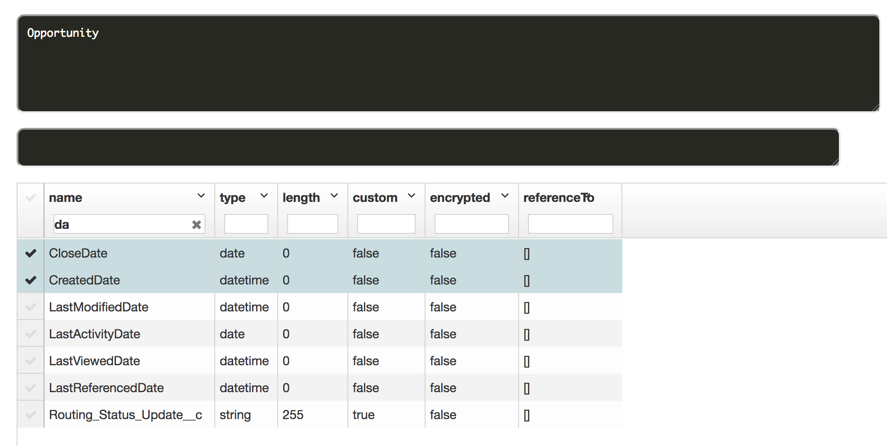
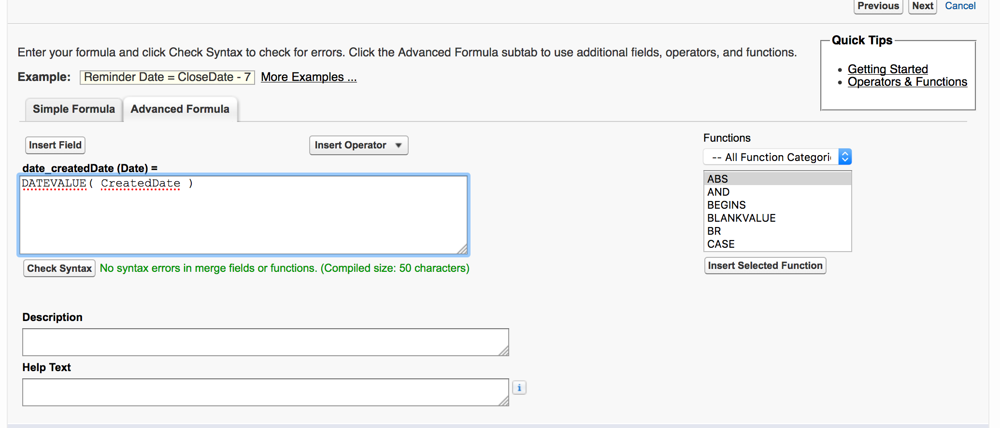

## SOQL Notes


### Date Functions

Allow to **group** or **filter** data by date-periods  (like day, calendar month, fiscal year)

```sql
SELECT CALENDAR_YEAR(CreatedDate), SUM(Amount)
		FROM Opportunity
			GROUP BY CALENDAR_YEAR(CreatedDate)

```


#### convertTimezone()

 **convertTimezone()** in a date function to convert dateTime fields to the user’s time zone.
 
 Example: Note convertTimezone() to be used in date function: HOUR_IN_DAY
 
 ```sql
 SELECT HOUR_IN_DAY(convertTimezone(CreatedDate)) hr, SUM(Amount) sum
		FROM Opportunity
	GROUP BY HOUR_IN_DAY(convertTimezone(CreatedDate))
 ```
 
 You **can't** use convertTimezone() on directly on DateTime field. Following query will **not** work:
 
```sql

 SELECT convertTimezone(CreatedDate)
		FROM Opportunity
```


### References

1.[Force.com SOQL and SOSL Reference] (https://developer.salesforce.com/docs/atlas.en-us.soql_sosl.meta/soql_sosl/sforce_api_calls_soql_select_date_functions.htm)


### Questions

1. Why this query does not work?

error: *Date-aggregate functions can only be selected in **group***ed queries*

```sql

SELECT CALENDAR_YEAR(CreatedDate), Amount
		FROM Opportunity
```

You can't use a date function in a SELECT clause unless you also include it in the GROUP BY clause

You can use a date function in a WHERE (**filter**) clause to filter the results even if the ** query doesn't include a GROUP BY clause**. The following query returns data for the year 2010:

```sql
SELECT CreatedDate, Amount
		FROM Opportunity
			WHERE CALENDAR_YEAR(CreatedDate) = 2017
			  LIMIT 2
```


2. Why this query does not work?

error: *Unknown error parsing query*

```sql
SELECT Id FROM Opportunity 
   WHERE CloseDate = date_CreatedDate__c
```

Data type of **CloseDate** is **date** while data type of **CreatedDate** is **datetime**




### Solution

Create a formula field returning Date and taking in DateTime;




