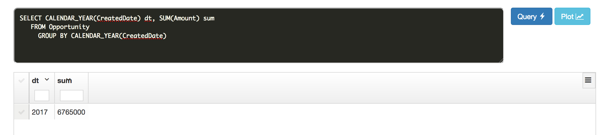
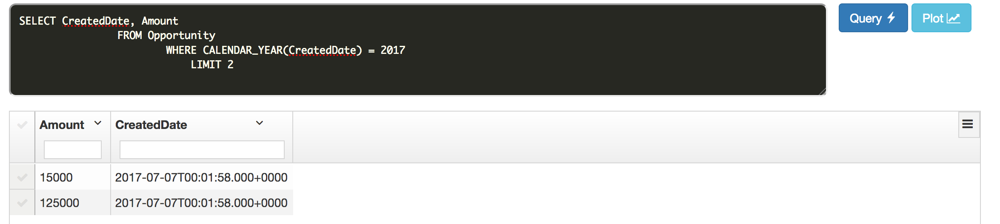

## SOQL Notes


### Date Functions

Allow to **group** or **filter** data by date-periods  (like day, calendar month, fiscal year)

```sql
SELECT CALENDAR_YEAR(CreatedDate), SUM(Amount)
		FROM Opportunity
			GROUP BY CALENDAR_YEAR(CreatedDate)

```




### References

1.[Force.com SOQL and SOSL Reference] (https://developer.salesforce.com/docs/atlas.en-us.soql_sosl.meta/soql_sosl/sforce_api_calls_soql_select_date_functions.htm)


### Questions

1. Why this query does not work: 

error: *Date-aggregate functions can only be selected in **group***ed queries*

```sql

SELECT CALENDAR_YEAR(CreatedDate), Amount
		FROM Opportunity
```

You can't use a date function in a SELECT clause unless you also include it in the GROUP BY clause

You can use a date function in a WHERE (**filter**) clause to filter the results even if the ** query doesn't include a GROUP BY clause**. The following query returns data for the year 2010:

```sql
SELECT CreatedDate, Amount
		FROM Opportunity
			WHERE CALENDAR_YEAR(CreatedDate) = 2017
			  LIMIT 2
```




